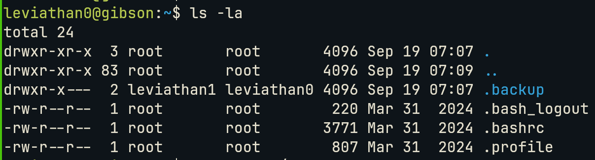
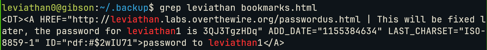
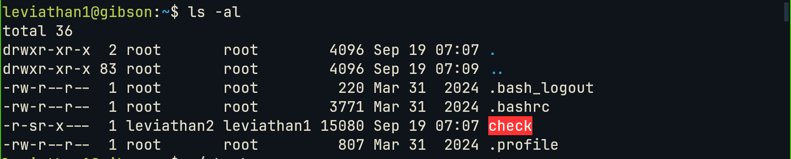
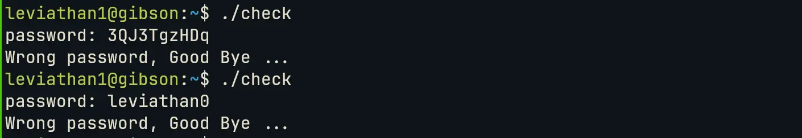
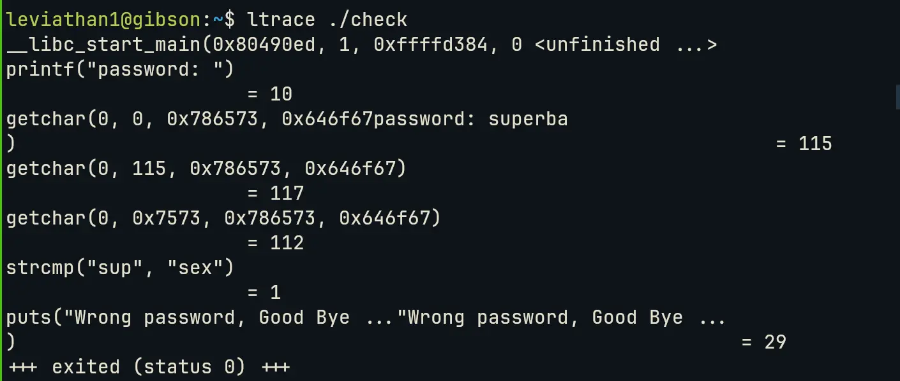
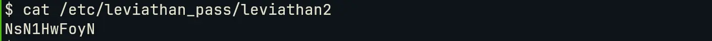

# OverTheWire - Leviathan

## Leviathan 0
As always, the first step is to connect to the server with `ssh leviathan0@leviathan.labs.overthewire.org -p 2223`.

Now let's look around:

as we can see there is an interesting directory named .backup, looking inside we find a bookmark.html folder containing 1299 lines of html syntax... but a simple `grep leviathan bookmarks.html` lifts the obscurity and shows us a bookmark with the password contained:

## Leviathan 1
After connecting to the server and checking the contents of the home folder we can see a  `check` executable with execution rights:

Let's try to execute the program:

It seems that the crux of this CTF is to find the password inside the executable, so let's see if `ltrace` gives us some useful information:

>[!note]
>`ltrace executable` executes a program intercepting concurrently all external library calls, like `printf()` or more interestingly `strcmp()`

the first three characters of the input strings are being read and compared with _sex_.

> [!note]
This let me on a sidequest to comprehend what the arguments of `getchar()` in the `ltrace` output mean. I think that the first number rapresents `stdin`, the second one is maybe a buffer where the read values are saved but the third and forth arguments are a big question.

Now let's use our newly found password:

And we are in, being logged as leviathan2, gives us access to the pass file for this user:

